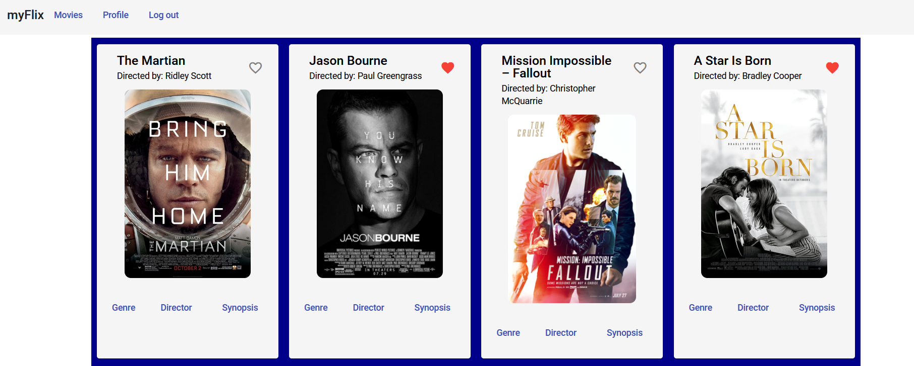

# Angular App (myFlix)

This project was generated with [Angular CLI](https://github.com/angular/angular-cli) version 12.2.12.

## Project Objectives:
Use angular to build the client-side for an application called myFlix based on its existing server-side code (REST API and database), with supporting documentation.

## Key Features:
- The app will display a welcome view where users will be able to either log in or register an account
- Once the user is authenticated, the user should be able to view all the movies in the existing database
- User will be able to view director's details upon click on button Director of individual movie
- User will be able to view genre's details upon click on button Genre of individual movie
- User will be able to view synopsis upon click on button Synopsis of individual movie
- User will be able to add movie to favorite's list upon click on the heart of individual movie card
- User will be able to view and to edit user profile

## Dependencies:
- Angular
- TypeScript
- Angular Material
- RxJS

## Development server

Run `ng serve` for a dev server. Navigate to `http://localhost:4200/`. The app will automatically reload if you change any of the source files.

## Code scaffolding

Run `ng generate component component-name` to generate a new component. You can also use `ng generate directive|pipe|service|class|guard|interface|enum|module`.

## Build

Run `ng build` to build the project. The build artifacts will be stored in the `dist/` directory.

## Running unit tests

Run `ng test` to execute the unit tests via [Karma](https://karma-runner.github.io).

## Running end-to-end tests

Run `ng e2e` to execute the end-to-end tests via a platform of your choice. To use this command, you need to first add a package that implements end-to-end testing capabilities.

## Further help

To get more help on the Angular CLI use `ng help` or go check out the [Angular CLI Overview and Command Reference](https://angular.io/cli) page.

#### Author: ####
:camel: Rina Ong-Oehme

#### Acknowledgements: ####
Treasure Kabareebe

